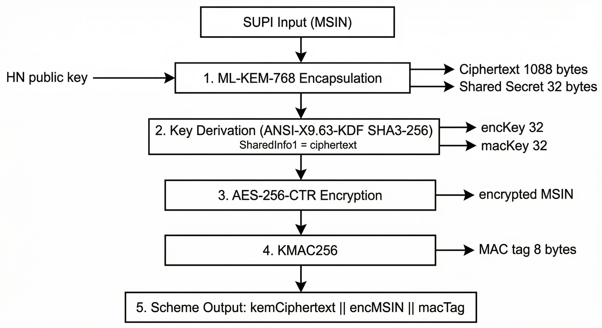
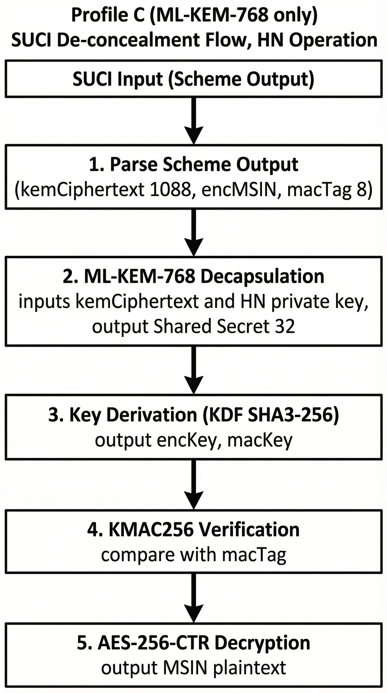
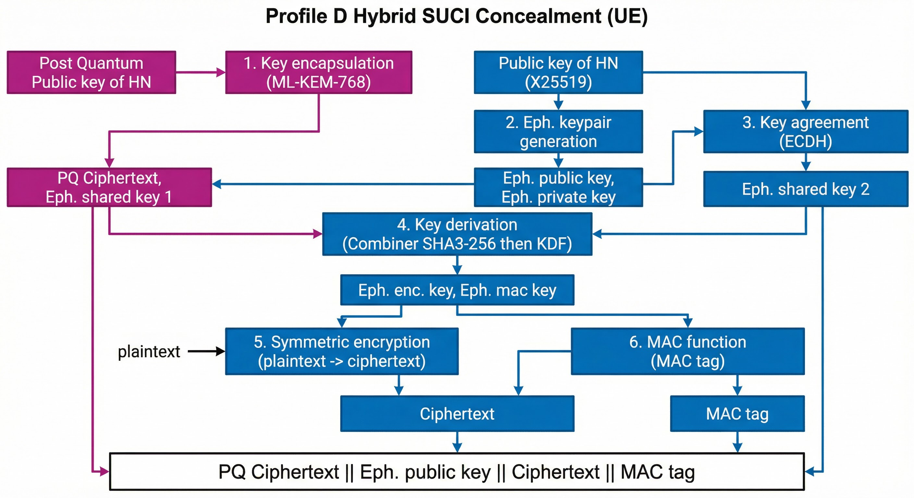
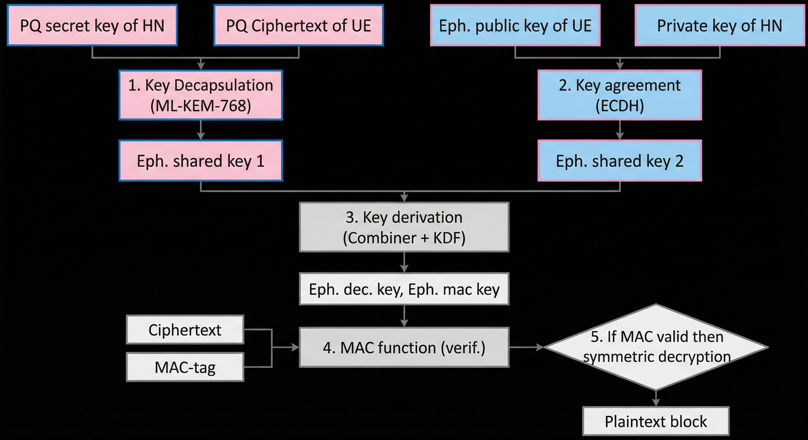

# SUCI-SUPI Tool - Documentation Index

This folder contains the supporting documentation, benchmarking reports, and raw
measurement logs for the SUCI-SUPI tool.

## Contents

| File | Description |
|------|-------------|
| [examples.md](examples.md) | Practical CLI usage examples for all profiles |
| [testing.md](testing.md) | Testing, benchmarking, and profiling guide |
| [Benchmarking-SUCI-SUPI-All.md](Benchmarking-SUCI-SUPI-All.md) | Comparative performance, memory, and SUCI-size assessment (Profiles A-F, Levels 3 and 5) |
| [benchmarking-report-from-logs-20260326.md](benchmarking-report-from-logs-20260326.md) | Report derived from the raw `logs/` dataset, with chart-ready CSV blocks |
| [profile-e-group-b2.md](profile-e-group-b2.md) | Profile E: Nested Hybrid specification (ECC protects PQ ciphertext, PQ protects MSIN) |
| [profile-f-group-c.md](profile-f-group-c.md) | Profile F: Wrapper Hybrid specification (standard ECIES unchanged, PQ wraps ephemeral key) |
| [profiles/](profiles/) | Profile design and variation plans (D/E/F) |
| [logs/](logs/) | Raw `details_collector` benchmark/load-generation logs used by the reports |

## Architecture and flow diagrams

The concealment and de-concealment flows for every profile (A, B, C, D and its
add17/add19 variants, E, F) are documented as detailed step-by-step diagrams in
[../ARCHITECTURE.md](../ARCHITECTURE.md). These cover the PQC and ECC branches,
key derivation, MAC, and the encrypt/decrypt stages.

Rendered flowchart figures for the PQC and Hybrid profiles:

| Figure | Description |
|--------|-------------|
|  | Profile C: PQC SUCI concealment flow (UE) - ML-KEM-768 |
|  | Profile C: PQC SUCI de-concealment flow (HN) - ML-KEM-768 |
|  | Profile D: Hybrid SUCI concealment flow (UE) - ML-KEM-768 + X25519 |
|  | Profile D: Hybrid SUCI de-concealment flow (HN) - ML-KEM-768 + X25519 |
